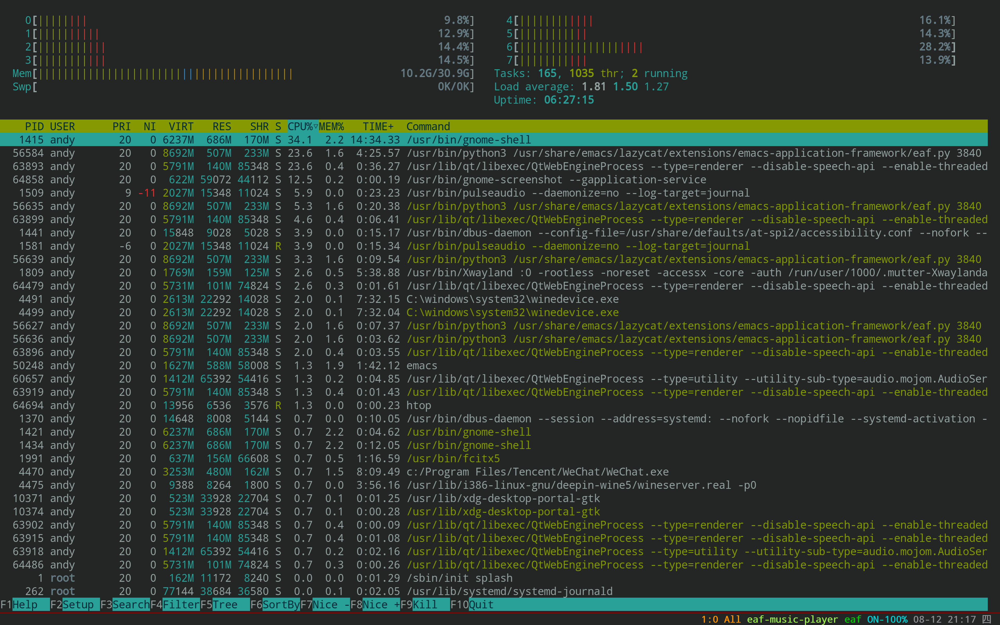

### EAF Terminal
<p align="center">
  
</p>

Terminal application for the [Emacs Application Framework](https://github.com/emacs-eaf/emacs-application-framework).

### Load application

[Install EAF](https://github.com/emacs-eaf/emacs-application-framework#install) first, then add below code in your emacs config:

```Elisp
(add-to-list 'load-path "~/.emacs.d/site-lisp/emacs-application-framework/")
(require 'eaf)
(require 'eaf-terminal)
```

### The keybinding of EAF Terminal.

| Key   | Event   |
| :---- | :------ |
| `M-j` | scroll_up |
| `M-k` | scroll_down |
| `s-J` | scroll_up |
| `s-K` | scroll_down |
| `C-v` | scroll_up_page |
| `M-v` | scroll_down_page |
| `M-<` | scroll_to_begin |
| `M->` | scroll_to_bottom |
| `C-z k` | scroll_to_begin |
| `C-z j` | scroll_to_bottom |
| `C--` | zoom_out |
| `C-=` | zoom_in |
| `C-0` | zoom_reset |
| `C-S-c` | copy_text |
| `C-S-v` | yank_text |
| `C-s` | search_text_forward |
| `M-s` | search_text_backward |
| `C-a` | eaf-send-key-sequence |
| `C-e` | eaf-send-key-sequence |
| `C-f` | eaf-send-key-sequence |
| `C-b` | eaf-send-key-sequence |
| `C-d` | eaf-send-key-sequence |
| `C-n` | eaf-send-key-sequence |
| `C-p` | eaf-send-key-sequence |
| `C-r` | eaf-send-key-sequence |
| `C-y` | eaf-send-key-sequence |
| `C-k` | eaf-send-key-sequence |
| `C-o` | eaf-send-key-sequence |
| `C-u` | eaf-send-key-sequence |
| `C-l` | eaf-send-key-sequence |
| `C-w` | eaf-send-key-sequence |
| `M-f` | eaf-send-key-sequence |
| `M-b` | eaf-send-key-sequence |
| `M-d` | eaf-send-key-sequence |
| `C-c C-c` | eaf-send-second-key-sequence |
| `C-c C-x` | eaf-send-second-key-sequence |
| `<f12>` | open_devtools |
| `M-w` | copy_text |
| `C-y` | yank_text |
| `C-S-a` | select_all |
| `C-S-l` | clear_selection |
| `C-M-l` | clear |
| `M-DEL` | eaf-send-alt-backspace-sequence |
| `M-<backspace>` | eaf-send-alt-backspace-sequence |
| `<escape>` | eaf-send-escape-key |

